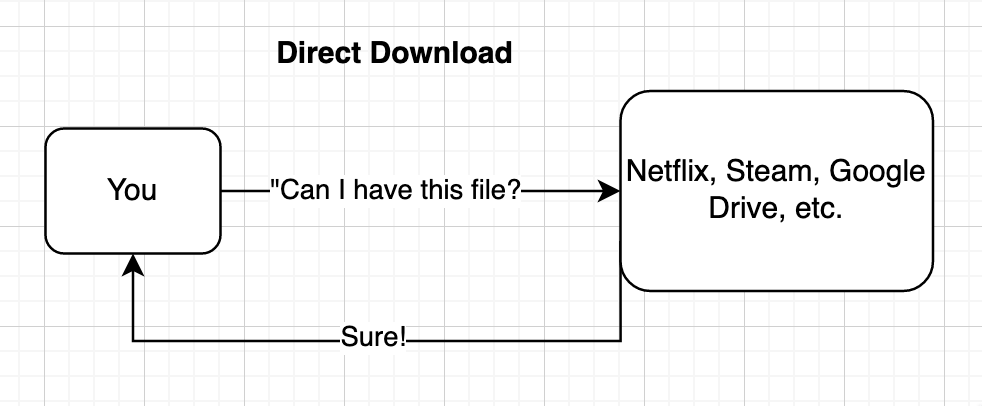
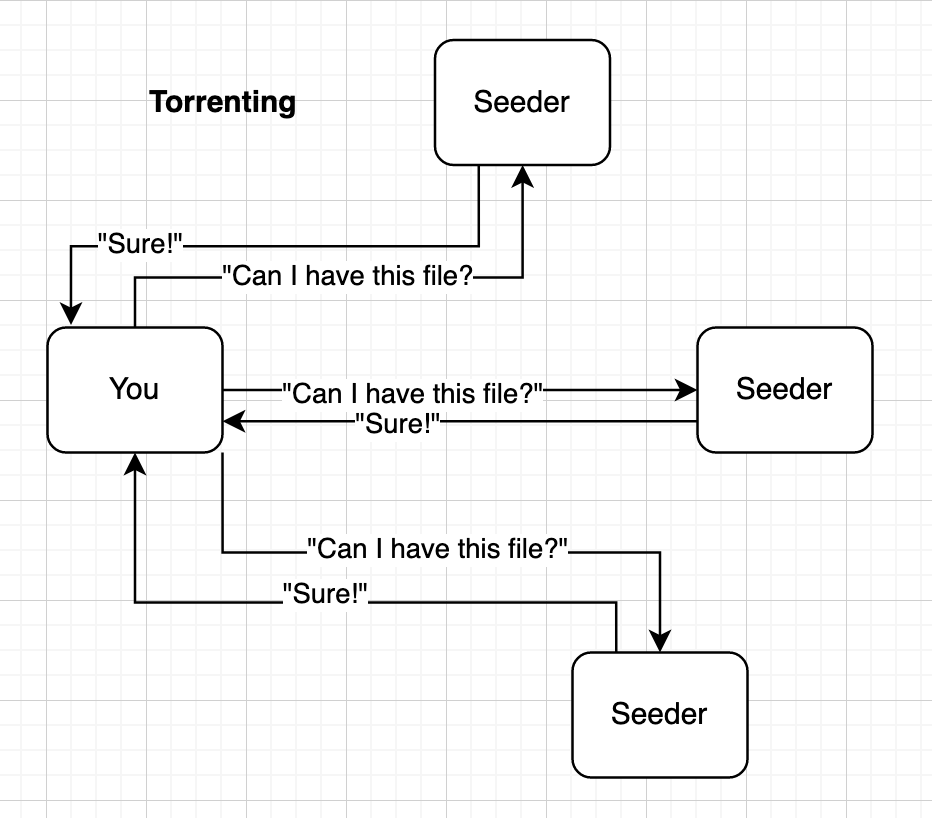

# Not A Piracy Guide
Not a guide to pirating all types of media.

## Table of Contents
* Introduction
* Disclaimer
* What should you actually use?
* Cost Tiers
* "What the f\*ck is a torrent?" and Other Questions You May Have
* VPNs
* DDL Clients
* Torrent Clients
* Real-Debrid
* Movies and TV
* Anime
* Music _coming soon_
* Games _coming soon_

## Introduction
For those coming from my shared Jellyfin, this was mainly made for you to help you achieve the best experience while watching movies and TV shows 100% legally after the shutdown. For everyone else, this is _not_ a piracy guide and will not assist you in breaking all sorts of copyright law to download free media like movies, TV, music, games, and anime. 

Sarcasm aside, this is my quick, simple guide to pirating media with ease and convenience. With tiers for those willing to spend a bit, a lot, or nothing at all, you're guaranteed to leave this Github page with some free sh\*t.

## Disclaimer
While I've done my best to vet all of these sites to ensure they don't contain malware or other malicious things, things may slip through the gaps, and I take ***absolutely ZERO responsibility*** for any damage done to your system by accessing **any** of the sites in this list (even for those marked as my personal recommendation). Multiple incidents have occured where previously reputable sites have turned rogue and began distributing malware. It also may occur that user error is a factor in causing issues.

I also take zero responsibility for any legal issues that arise from using this guide. Issues can include, but are not limited to, DMCA letters, suspension of internet service, fines, etc.

## What should you actually use?
There's a lot of sites and resources that will be listed here, and you might end up being overwhelmed. The website or service that I would recommend in each section and cost tier is marked with **bold text**.

## Cost Tiers
> But wait, I thought the point of pirating my media was so that it would be free?

Don't worry, all sections will have a free tier. However, you get what you pay for, and paying for services like Real-Debrid or a VPN (both of which I'll talk about in more detail later) can improve your experience tenfold. The majority of free services listed will have slower speeds, lower resolution content, more ads, and an overall worse experience compared to paid services. Again, you get what you pay for.

## "What the f\*ck is a torrent?" and Other Questions You May Have
Piracy introduces a lot of new standards, technologies, and other things that don't exist or are completely hidden to the user on legal services. This introduces a swarm of new questions that I'll do my best to answer.

> What the f\*ck is a torrent?
When downloading pirated media, a torrent is the most common download type you'll find, and basically every site will have them available. To explain what they are, I'll need to explain Direct Download as well.

In most cases, files downloaded or streamed from the internet are downloaded from one central server. When you stream from Netflix, you stream from Netflix's server. When you download a game from Steam, you download from Steam's server. Obviously, bigger companies will have hundreds or even thousands of servers around the globe for the fastest download performance, but that's the gist of it.

^^ That diagram is a serious oversimplification, but that's all it is. In the case of services like Netflix or Disney+, this is the best solution from a user and sys-admin perspective for a variety of reasons. When you're sailing the seven seas, Direct Download (DDL) unfortunately makes files much more likely to be taken down.

This is where torrents come in. Torrents completely remove the need for a central server by making _you_ (and everyone else downloading the file) the server. When you open a .torrent file or a magnet link in your torrent client, you begin downloading the file from everyone else downloading the file. Plus, when someone else starts downloading the file, you'll start uploading the file as well, even if you haven't finished the download yet. When you start uploading, you're what's known as a "seeder". Downloading without seeding is known as "leeching", and is generally frowned upon within the piracy community.

Torrents are also practically impossible to take down. While you could take down the website providing the .torrent file that tells your torrent client where to look for the file(s), you can't take down a torrent unless everyone seeding the file stops seeding it.

Torrents do bring up issues with obscure content though. If a file doesn't have many seeders, the download speed will be much slower than something with many seeders. For files like these, DDL is better.

> Why do I need a VPN?
A VPN, or Virtual Private Network, masks your IP making you more anonymous when you're on the internet. You've probably heard this phrase in a hundred different wordings from the hundreds of YouTubers sponsored by NordVPN/Surfshark/ExpressVPN/Private Internet Access/\[insert other VPN\], and this IP address masking is seriously helpful when torrenting files.

Because of the peer-to-peer (P2P) nature of torrents, your IP address is leaked to every other person downloading the torrent. This would usually be fine, but big movie studios will hire companies to download these torrents (known as copyright trolls), look through all of the IP addresses, send notices to your Internet Service Provider (ISP), and make them send you threatening letters or even cut off your internet. When using a VPN, the other peers in the download will see the IP of your VPN, including the copyright trolls. If you have a good VPN for torrenting, your VPN provider will receive the copyright notice, not know who the IP belongs to, and tell the copyright troll to get f\*cked in nice legal terms.

If you're using DDL or Real-Debrid, you usually don't need to worry about a VPN.

> What is Real-Debrid?
See Real-Debrid.
